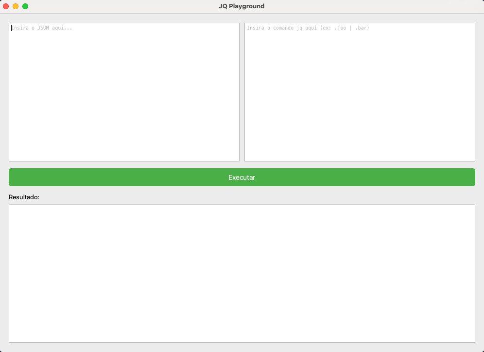

# JQ Playground (PyQt6)

## Description

A simple desktop application built with **Python** and **PyQt6**, designed as a playground for testing [`jq`](https://stedolan.github.io/jq/) commands on JSON input.
The interface consists of three main sections:

- **Left:** Editable JSON input area.
- **Right:** Editable `jq` command input area.
- **Bottom:** Output area showing the result of execution.

Perfect for quickly experimenting with `jq` queries locally.

<p align="center">
  
</p>

---

## Dependencies

- Python 3.8+
- [PyQt6](https://pypi.org/project/PyQt6/)
- [`jq`](https://stedolan.github.io/jq/) installed and available in your system's PATH

---

## Install

1. Clone the repository:

    ```bash
    git clone https://github.com/your-username/jq-playground.git
    cd jq-playground
    ```

2. (Optional) Create and activate a virtual environment:

    ```bash
    python3 -m venv venv
    source venv/bin/activate  # macOS/Linux
    # or
    venv\Scripts\activate     # Windows
    ```

3. Install Python dependencies:

    ```bash
    pip install -r requirements.txt
    ```

4. Make sure `jq` is installed on your system:

    ```bash
    brew install jq  # macOS
    ```

---

## Usage

### Option 1: Run directly

```bash
python jq_playground.py
```

### Option 2: Create a symbolic link (shortcut)

You can use the provided shell script to create a symbolic link and run the app from anywhere:

```bash
./install.sh
```

This will create a symlink in:
```bash
/usr/local/bin/jq-playground
```

Then you can simply run the app from the terminal:

```bash
jq-playground
```

## LAUS DEO ∴
